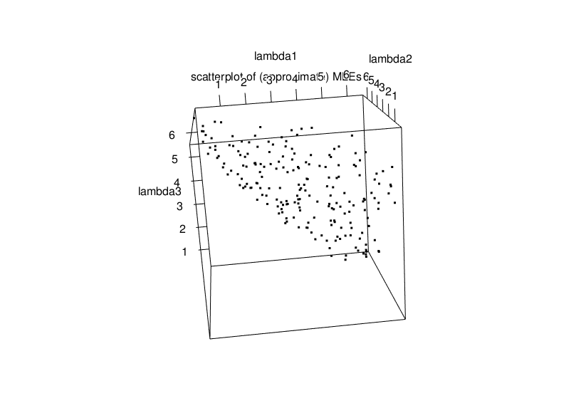
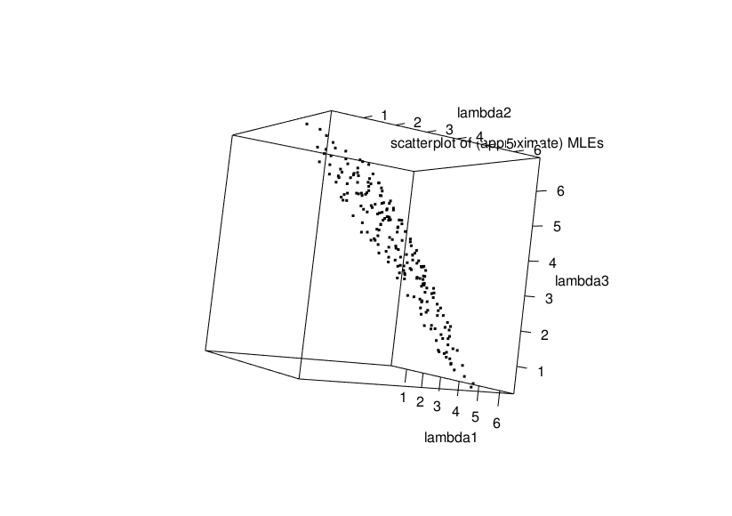

```{r setup, include=FALSE}
knitr::opts_chunk$set(echo = TRUE)
```

This is not to be taken as part of my paper. I am only exploring the idea
we discussed in the last meeting.
A summary of my results: the likelihood is proportional to
$$
    L(\theta) \propto \prod_{i=1}^n f(t_i;\theta)
$$
because the candidate sets as we defined them in our last meeting are
independent of the component times-to-failures and $\theta$.

However, in case I was mistaken, I still use the log-likelihood you described in
our last meeting and run the simulations to estimate the MLE. It doesn't work.
When I use the $L(\theta) \propto \prod_{i=1}^n f(t_i;\theta)$ it works as
expected, although the MLE solutions are the set of points in a plane in 3D in
the case of the exponential series system.

Anyway, I push on and do thesimulations. So, from our discussion and previous
email, I am going to generate a candidate set by sampling from a Bernoulli
distribution for each component label,
$$
    X_{i j} \sim \operatorname{bernoulli}(p_j)
$$
for $j=1,\ldots,m$, with the exception that we don't allow all of them to
be zero, i.e., $X_{i 1}+X_{i 2}+\cdots+X_{i m}$ cannot equal zero.
To make things simple, I am going to ignore right censoring.
Here is function to generate a candidate set according to this model/scheme:
```{r}
# p is a vector of probabilities for the bernoulli distributions
bernoulli_const_cand <- function(p)
{
    m <- length(p)
    repeat {
        u <- runif(n=m,min=0,max=1)
        # x is a vector of m Boolean variables representing a candidate set
        x <- ifelse(u < p,1,0)
        # if at least one x_j is 1, accept it, otherwise try again
        if (sum(x) > 0)
            return(x)
    }    
}
```

Let's assume that we have a series system with $m=3$ components, each of which has
an exponentially distributed time-to-failure,
$$
    T_{i j} \sim \operatorname{exponential}(\lambda_j).
$$
for $j=1,\ldots,m$ and $i=1,\ldots,n$.

Normally, we do not know $\boldsymbol{\theta} = (\lambda_1,\ldots,\lambda_m)$,
but since we are going to simulate the data, let's fix it to
$\boldsymbol{\theta} = (3,5,4)$.

Here is function to observe $n$ realizations of $(T_{i 1},T_{i 2}, T_{i 3})$
parameterized by $\boldsymbol{\theta}$.
It returns a $n$-by-$m$ matrix where the $j$-th row is the realization of $(T_{j 1},T_{j 2}, T_{j 3}, T_{j 4})$:
```{r}
component_ttf <- function(n,theta)
{
    m <- length(theta)
    ttfs <- matrix(nrow=n,ncol=m)
    for (j in 1:m)
        ttfs[,j] <- stats::rexp(n,theta[j])
    return(ttfs)
}
```

The time-to-failure of a series system is given by
$$
    T_i = \min\{T_{i 1},\ldots,T_{i m}\}.
$$
So, given component times-to-failure data `comp_ttfs`, the series system
times-to-failure is given by the following R code:
```{r}
# series system as a function of component lifetimes
series_ttf <- function(comp_ttfs)
    apply(comp_ttfs, 1, function(x) min(x))
```

We can generate some new masked data with:
```{r}
# setup simulation parameters
n <- 1000
theta <- c(3,5,4)
# bernoulli probabilities. we choose to use .5 for all to make it as simple
# as possible. later, we'll see what happens when we change these.
p <- c(.5,.5,.5)
m <- length(p)

# generate masked data
# --------------------
# compoent times-to-failures
comp_ttfs <- component_ttf(n,theta)
# series system time to failure as a function of comp_ttfs
ttfs <- series_ttf(comp_ttfs)
# candidate sets
const_cand <- matrix(nrow=n,ncol=m)
for (i in 1:n)
    const_cand[i,] <- bernoulli_const_cand(p)
```

Here is our masked data, using the constant Bernoulli candidate model as
described previously:
```{r}
# show masked data: series system time-to-failure and candidate set
md <- data.frame(ttf=ttfs,candidates=const_cand)
names(md) <- c("Time-to-failure", paste0("X",1:m))
head(md)
```

We have some masked data.
If we use the likelihood function specified in the paper "Estimating Component
Reliabilities from Incomplete System Failure Data", Equation 10, then the
likelihood function is
\begin{align*}
L(\theta)
    &= \prod_{i=1}^n \sum_{j \in C_i} f_j(t_i;\theta_j) \prod_{\substack{p=1\\p \neq j}} R_p(t_i;\theta_p)\\
    &= \prod_{i=1}^n \left[\left\{\prod_{j=1}^m R_j(t_i;\theta_j)\right\}
    \left\{ \sum_{k \in C_i} h_k(t_i;\theta_k) \right\}\right]\\
\end{align*}
and the log-likelihood function is
$$
l(\theta) = \sum_{i=1}^n \sum_{j=1}^m \log R_j(t_i;\theta_j)
    + \sum_{i=1}^n \log \left\{ \sum_{k \in C_i} h_k(t_i;\theta_k) \right\}.
$$
For computational convenience, we use the log-likelihood for finding the MLEs.
For a series system with components with exponentially distributed
times-to-failure, the log-likelihood is given by the following code:
```{r}
# generator for log-likelihood function
loglike.exp.constant.ber <- function(ttfs,candidates)
{
    n <- length(ttfs)
    m <- ncol(candidates)
    function(theta)
    {
        res <- 0
        for (i in 1:n)
            res <- res + log(sum(theta[candidates[i,]]))
        return(res - sum(theta) * sum(ttfs))
    }
}
```

We numerically solve the MLE with the Newton-Raphson method:
```{r}
library(MASS)
# l is log-likehood
# theta0 is initial estimate of theta
# eps is stopping condition for infinity norm
mle.newton <- function(l,theta0,eps=1e-3)
{
    repeat
    {
        theta1 <- theta0 - MASS::ginv(numDeriv::hessian(l,theta0)) %*%
            numDeriv::grad(l,theta0)
        if (abs(sum(theta1-theta0)) < eps)
            return(theta1)
        theta0 <- theta1
    }
}
```

So, let's set up the log-likelihood function:
```{r}
l.constant.ber <- loglike.exp.constant.ber(ttfs,const_cand)
mle.newton(l.constant.ber,c(1,1,1))
```
When we run the MLE newton solver, we get non-sense results as given above.
Let's look at the profile of the log-likehood function with the first two
parameters assumed to be known, and thus only estimating the final
parameter $\lambda_3$:
```{r}
l.constant.ber.prof <- function(x) l.constant.ber(c(theta[1],theta[2],x))
x <- seq(0,0.1,length.out=100)
y <- numeric(length(x))
for (i in 1:length(x))
{
    y[i] <- l.constant.ber.prof(x[i])
}
plot(x,y,xlab="lambda3",ylab="loglike",main="profile of incorrect log-ikelihood with\nlambda1=3 and lambda2=5 known")
```

This is not right. The problem is that
\begin{align*}
L(\theta)
    &= \prod_{i=1}^n \sum_{k \in C_i} f_k(t_i;\theta_k) \prod_{\substack{j=1\\j\neq k}}^m R_j(t_i;\theta_j)\\
    &= \left\{\prod_{i=1}^n \sum_{k \in C_i} h_k(t_i;\theta_k) \right\} \left\{\prod_{j=1}^m R_j(t_i;\theta_j)\right\}
\end{align*}
is not the correct likelihood function for the data we are generating.

When we look at how the data is generated, we see that the candidate sets
and the times-to-failures are independent.
Thus, we see that the joint distribution of $f(t_i,C_i;\theta) = f(t_i;\theta)f(C_i)$,
where our Bernoulli candidate sets $C_1,\ldots,C_n$ are not a function of $\theta$.
Thus,
$$
L(\theta) \propto \prod_{i=1}^n f(t_i;\theta).
$$

For the series system with exponentially distributed component lifetimes,
the series system itself is exponentially distributed with a failure rate
$\sum_{j=1}^m \lambda$. So, the MLEs are an infinite set of solutions given by
$$
    \hat\lambda_1 + \hat\lambda_2 + \hat\lambda_3 = \frac{1}{\bar{t}},
$$
where $\bar{t} = \frac{1}{n} \sum_{i=1}^n t_i$ and $t_i$ is the $i$-th
series system time to failure. In this case, $\bar{t}$ is:
```{r}
mean(ttfs)
```
Note that this is just an equation for plane in $3$d.
If we do the profile log-likelihood as before, with $\lambda_1 = 3$ and $\lambda_2 = 5$
known, get the result:
```{r,cache=F}
# generate log-likelihood function
loglike.exp.series <- function(ttfs)
{
    n <- length(ttfs)
    function(theta)
    {
        n*log(sum(theta)) - sum(theta)*sum(ttfs)
    }
}
l.series <- loglike.exp.series(ttfs)
l.series.prof <- function(x) l.series(c(theta[1],theta[2],x))
x <- seq(theta[3]-2,theta[3]+2,length.out=1000)
y <- numeric(length(x))
for (i in 1:length(x))
{
    y[i] <- l.series.prof(x[i])
}
plot(x,y,xlab="lambda3",ylab="loglike",
     main="profile of likelihood\n(ignores the useless candidate sets)\nwith lambda1=3 and lambda2=5 known")
```

We see that it's peaked around $\hat\lambda_3 = 4$, as expected.
Let's stick with the numerical simulation methods and plot a bunch of points:
```{r,cache=T}
# this is very inefficient and slow, but it works reasonable well when
# given extremely large trials to find many points that satisfy the MLE equations
mle.random <- function(l,theta0,trials=50000,min=1e-3,max=7)
{
    m <- length(theta0)
    theta.hat <- theta0
    l.theta.hat <- l(theta.hat)
    for (i in 1:trials)
    {
        theta.b <- runif(n=m,min,max)
        l.theta.b <- l(theta.b)
        if (l.theta.hat < l.theta.b)
        {
            theta.hat <- theta.b
            l.theta.hat <- l.theta.b
        }
    }
    return(theta.hat)
}

N <- 200
theta.rnds <- matrix(nrow=N,ncol=3)
for (i in 1:N)
    theta.rnds[i,] <- mle.random(l.series,c(1,1,1),200000)
#library(rgl)
#plot3d(theta.rnds[,1],theta.rnds[,2],theta.rnds[,3],
#       main="scatterplot of MLEs",
#       xlab = "lambda1",
#       ylab = "lambda2",
#       zlab = "lambda3")
#rgl.snapshot('3dplot#.png',fmt='png')
```

We use the above code to generate two scatter plots:
```{r scatterplots, echo=FALSE, fig.cap="Scatterplots of MLEs", out.width = '90%'}

```
```{r scatterplots2, echo=FALSE, fig.cap="Scatterplots of MLEs", out.width = '90%'}

```

The scatterplots show a plane at two different angles that (approximately)
satisfies the equation
$$
    \hat\lambda_1 + \hat\lambda_2 + \hat\lambda_3 = \frac{1}{\bar{t}}.
$$
