## Reliability Estimation in Series Systems: Maximum Likelihood Techniques for Right-Censored and Masked Failure Data

Alex Towell
Email: [lex@metafunctor.com](mailto:lex@metafunctor.com)
GitHub: [github.com/queelius](https://github.com/queelius)

---
## Context & Motivation

**Reliability** in **Series Systems** is like a chain's strength -- determined
by its weakest link.

- Essential for system design and maintenance.
 
**Main Goal**: Estimate individual component reliability from *failure data*.

**Challenges**:

- *Masked* component-level failure data.
- *Right-censoring* system-level failure data.

**Our Response**:

- Derive techniques to interpret such ambiguous data.
- Aim for precise and accurate reliability estimates for individual components
  using maximum likelihood estimation (MLE)
- Quantify uncertainty in estimates with bootstrap confidence intervals (CIs).

---
## Core Contributions

**Likelihood Model** for **Series Systems**.

- Accounts for *right-censoring* and *masked component failure*.

**Specifications of Conditions**:

- Assumptions about the masking of component failures.
- Simplifies and makes the model more tractable.

**Simulation Studies**:

- Components with *Weibull* lifetimes.
- Evaluate MLE and confidence intervals under different scenarios.

**R Library**: Methods available on GitHub.

- See: [www.github.com/queelius/wei.series.md.c1.c2.c3](https://github.com/queelius/wei.series.md.c1.c2.c3)

---
## What Is A Series System?

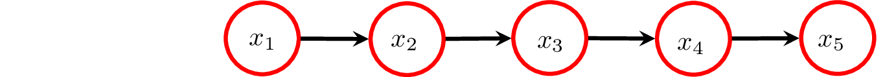

**Critical Components**: Complex systems often comprise *critical* components.
If any component fails, the entire system fails.

- We call such systems *series systems*.
- **Example**: A car's engine and brakes.

**System Lifetime** is dictated by its shortest-lived component:
$$
T_i = \min(T_{i 1}, \ldots, T_{i 5})
$$
where:

- $T_i$ is the lifetime of $i^{\text{th}}$ system.
- $T_{i j}$ is the $j^{\text{th}}$ component of $i^{\text{th}}$ system.

---
## Reliability Function
**Reliability Function** represents the probability that a system or component functions
beyond a specified time.

- Essential for understanding longevity and dependability.

**Series System Reliability**: Product of the reliability of its components:
$$
R_{T_i}(t;\boldsymbol\theta) = \prod_{j=1}^m R_j(t;\boldsymbol{\theta_j}).
$$

- If any component has low reliability, it can impact the whole system.
- Here, $R_{T_i}(t;\boldsymbol\theta)$ and $R_j(t;\boldsymbol{\theta_j})$ are the reliability
  functions for the system $i$ and component $j$, respectively.

---
## Hazard Function: Understanding Risks

**Hazard Function**: Measures the immediate risk of failure at a given time,
assuming survival up to that moment.

- Reveals how the risk of failure evolves over time.
- Guides maintenance schedules and interventions.

**Series System Hazard Function**: Sum of the component hazard functions:
$$
h_{T_i}(t;\boldsymbol{\theta}) = \sum_{j=1}^m h_j(t;\boldsymbol{\theta_j}).
$$

- Components' risks are additive.

---
## Joint Distribution of Component Failure and System Lifetime
Our likelihood model depends on the **joint distribution** of the system
lifetime and the component that caused the failure.

- **Formula**: Product of the failing component's hazard function and the system
reliability function:
$$
f_{K_i,T_i}(j,t;\boldsymbol\theta) = h_j(t;\boldsymbol{\theta_j}) R_{T_i}(t;\boldsymbol\theta).
$$
- Here, $K_i$ denotes component cause of $i^{\text{th}}$ system's failure.

---
## Component Cause of Failure

We can use the joint distribution to calculate the probability of component
cause of failure.

- Helps predict the cause of failure.
- **Derivation**: Marginalize the joint distribution over the system lifetime:
$$
\Pr\{K_i = j\} = E_{\boldsymbol\theta} \biggl[ \frac{h_j(T_i;\boldsymbol{\theta_j})} {h_{T_i}(T_i ; \boldsymbol{\theta_l})} \biggr].
$$
- **Well-Designed Series System**: Components exhibit comparable chances of
causing system failures.
- **Relevance**: Our simulation study employs a (reasonably) well-designed
series system.

---
## Likelihood Model: Data Generating Process

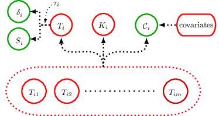

The data generating process (DGP) is the underlying process that generates the data.
*Green* elements are observed, *red* elements are latent:

- **Right-Censored** lifetime: $S_i = \min(T_i, \tau_i)$
- **Event Indicator**: $\delta_i = 1_{\{T_i < \tau_i\}}$
- **Candidate Set**: $\mathcal{C}_i$ related to components

---
## Likelihood Function

**Likelihood Function** measures how well model explains the data:

- **Right-Censored** data ($\delta_i = 0$).
- **Candidate Sets** or **Masked Failure** data ($\delta_i = 1$)

| System | Right-Censored Lifetime ($S_i$) | Event Indicator ($\delta_i$) | Candidate Set ($\mathcal{C}_i$) |
|--------|---------------------------------|------------------------------|---------------------------------|
| 1      | $1.1$                           | 1                            | $\{1,2\}$                       |
| 2      | $5$                             | 0                            | $\emptyset$                     |
  

Each system contributes to *total likelihood* via its *likelihood contribution*:
$$
L(\boldsymbol\theta|\text{data}) = \prod_{i=1}^n L_i(\boldsymbol\theta|\text{data}_i)
$$
where data$_i$ is for $i^{\text{th}}$ system and $L_i$ is its contribution.

---
## Likelihood Contribution: Right-Censoring

**Right-Censoring**: For the $i^{\text{th}}$ system, if right-censored ($\delta_i = 0$)
at duration $\tau$, its likelihood contribution is proportional to the system reliability function evaluated at $\tau$:
$$
L_i(\boldsymbol\theta) \propto R_{T_i}(\tau;\boldsymbol\theta).
$$

- We only know that a failure occurred after the right-censoring time.
- This is captured by the system reliability function.

**Key Assumptions**:

- Censoring time ($\tau$) independent of parameters.
- Event indicator ($\delta_i$) is observed.
- **Reasonable** in many cases, e.g., right-censoring time $\tau$ predetermined by length of study.

---
## Likelihood Contribution: Candidate Sets

**Masking Component Failure**: If the $i^{\text{th}}$ system fails ($\delta_i = 1$),
it is masked by a candidate set $\mathcal{C}_i$. Its likelihood contribution is complex and
we use simplifying assumptions to make it tractable.

- **Condition 1**: The candidate set includes the failed component: $\Pr\{K_i \in \mathcal{C}_i\} = 1$.

- **Condition 2**: The condition probability of a candidate set given a cause of failure and a system lifetime is constant across conditioning on different failure causes within the candidate set: $\Pr\{\mathcal{C}_i = c_i | T_i = t_i, K_i = j\} = \Pr\{\mathcal{C}_i = c_i | T_i = t_i, K_i = j'\}$ for $j,j' \in c_i$.

- **Condition 3**: The masking probabilities when conditioned on the system lifetime and the failed component aren't functions of the system parameter.

---
### Likelihood Contribution: Derivation for Candidate Sets

Take the **joint distribution** of $T_i$, $K_i$, and $\mathcal{C}_i$ and marginalize over $K_i$:
$$
f_{T_i,\mathcal{C}_i}(t_i,c_i;\boldsymbol{\theta}) = \sum_{j=1}^m f_{T_i,K_i}(t_i,j;\boldsymbol{\theta})\Pr{}_{\!\boldsymbol\theta}\{\mathcal{C}_i = c_i | T_i = t_i, K_i = j\}.
$$
Apply **Condition 1** to get a sum over candidate set:
$$
f_{T_i,\mathcal{C}_i}(t_i,c_i;\boldsymbol{\theta}) = \sum_{j \in c_i} f_{T_i,K_i}(t_i,j;\boldsymbol\theta)\Pr{}_{\!\boldsymbol\theta}\{\mathcal{C}_i = c_i | T_i = t_i, K_i = j\}.
$$

---
### Likelihood Contribution: Derivation for Candidate Sets (Cont'd)

Apply **Condition 2** to move probability outside the sum:
$$
f_{T_i,\mathcal{C}_i}(t_i,c_i;\boldsymbol{\theta}) = \Pr{}_{\!\boldsymbol\theta}\{\mathcal{C}_i = c_i | T_i = t_i, K_i = j'\} \sum_{j \in c_i} f_{T_i,K_i}(t_i,j;\boldsymbol\theta).
$$
Apply **Condition 3** to remove the probability's dependence on $\boldsymbol\theta$:
$$
f_{T_i,\mathcal{C}_i}(t_i,c_i;\boldsymbol{\theta}) = \beta_i \sum_{j \in c_i} f_{T_i,K_i}(t_i,j;\boldsymbol\theta).
$$
**Result**: $L_i(\boldsymbol\theta) \propto \sum_{j \in c_i} f_{T_i,K_i}(t_i,j;\boldsymbol\theta) = R_{T_i}(t_i;\boldsymbol\theta) \sum_{j \in c_i} h_j(t_i;\boldsymbol{\theta_j})$.

---
## Bootstrap Confidence Intervals (CIs)

**Confidence Intervals (CI)** help capture the *uncertainty* in our estimate.

- **Normal** assumption for constructing CIs may not be accurate.
  - *Masking* and *censoring*.
- **Bootstrapped CIs**: Resample data and obtain MLE for each.
  - Use **percentiles** of bootstrapped MLEs for CIs.
- **Coverage Probability**: Probability the interval covers the true parameter value.
  - **Challenge**: Actual coverage may deviate to bias and skew in MLEs.
- **BCa** adjusts the CIs to counteract bias and skew in the MLEs.

---
## Challenges with Masked Data

Like any model, ours has its challenges:

- **Convergence Issues**: Nearly flat likelihood regions can occur.
  - Ambiguity in masked, censored data
  - Complexities of estimating latent parameters.

- **Bootstrap Issues**: Relies on the empirical sampling distribution.
  - May not represent true variability for small samples.
  - *Censoring* and *masking* compound issue by reducing the **effective** sample size.

- **Mitigation**: In simulation, discard non-convergent samples for MLE on
  original data but retain all resamples for CIs.
  - More robust assessment at the cost of possible bias towards "well-behaved" data.  
  - **Convergence Rates** reported to provide context.

---
# Simulation Study: Series System with Weibull Components

## Series System Parameters

| Component | Shape $(k_j)$ | Scale ($\lambda_j$) | Failure Probability ($\Pr\{K_i\}$) |
|-----------|-------|--------|--------------|
| 1         | 1.26  | 994.37 | 0.17         |
| 2         | 1.16  | 908.95 | 0.21         |
| 3         | 1.13  | 840.11 | 0.23         |
| 4         | 1.18  | 940.13 | 0.20         |
| 5         | 1.20  | 923.16 | 0.20         |

**Lifetime** of $j^{\text{th}}$ component of $i^{\text{th}}$ system: $T_{i j} \sim \operatorname{Weibull}(k_j,\lambda_j)$.

- Based on (Guo, Niu, and Szidarovszky 2013)
- Extended to include components 4 and 5
  - Shapes greater than 1 indicates wear-outs.
  - Probabilities comparable: reasonably **well-designed**.
- Focus on Components 1 and 3 (most and least reliable) in study.

---
## Synthetic Data and Simulation Values

How is the data generated in our simulation study?

- **Component Lifetimes** (latent $T_{i 1}, \cdots, T_{i m}$) generated for each system.
  - **Observed Data** is a function of latent components.
- **Right-Censoring** amount controlled with simulation value $q$.
  - Quantile $q$ is probability system won't be right-censored.
  - Solve for right-censoring time $\tau$ in $\Pr\{T_i \leq \tau\} = q$.
  - $S_i = \min(T_i, \tau)$ and $\delta_i = 1_{\{T_i \leq \tau\}}$.
- **Candidate Sets** are generated using the *Bernoulli Masking Model*.
  - Masking level controlled with simulation value $p$.
  - Failed component (latent $K_i$) placed in candidate set (observed $\mathcal{C}_i$).
  - Each functioning component included with probability $p$.

---
## Bernoulli Masking Model: Satisfying Masking Conditions

The Bernoulli Masking Model *satisfies* the masking conditions:

- **Condition 1**: The failed component deterministically placed in candidate set. 
- **Condition 2** and **3**: Bernoulli probability $p$ is same for all components
and fixed by us.
  - Probability of candidate set is constant conditioned on component failure within set.
  - Probability of candidate set, conditioned on a component failure, only
    depends on the $p$.

**Future Research**: Realistically conditions may be violated.

  - Explore sensitivity of likelihood model to violations.

---
## Performance Metrics

**Objective**: Evaluate the MLE and BCa confidence intervals' performance across
various scenarios.

- Visualize the **simulated** sampling distribution of MLEs and $95\%$ CIs.
- **MLE Evaluation**:
  - **Accuracy**: Bias 
  - **Precision**: Dispersion of MLEs
    - $95\%$ quantile range of MLEs.
- **95\% CI Evaluation**:
  - **Accuracy**: Coverage probability (CP).
    - *Correctly Specified* CIs: CP near $95\%$ ($>90\%$ acceptable).
  - **Precision**: Width of median CI.
  
---
## Scenario: Impact of Right-Censoring

Assess the impact of right-censoring on MLE and CIs.

- **Right-Censoring**: Failure observed with probability $q$: $60\%$ to $100\%$.
  - Right censoring occurs with probability $1-q$: $40\%$ to $0\%$.
- **Bernoulli Masking Probability**: Each component is a candidate with probability $p$ fixed at $21.5\%$.
  - Estimated from original study (Guo, Niu, and Szidarovszky 2013).  
- **Sample Size**: $n$ fixed at $90$.
  - Small enough to show impact of right-censoring.

---
## Scale Parameters

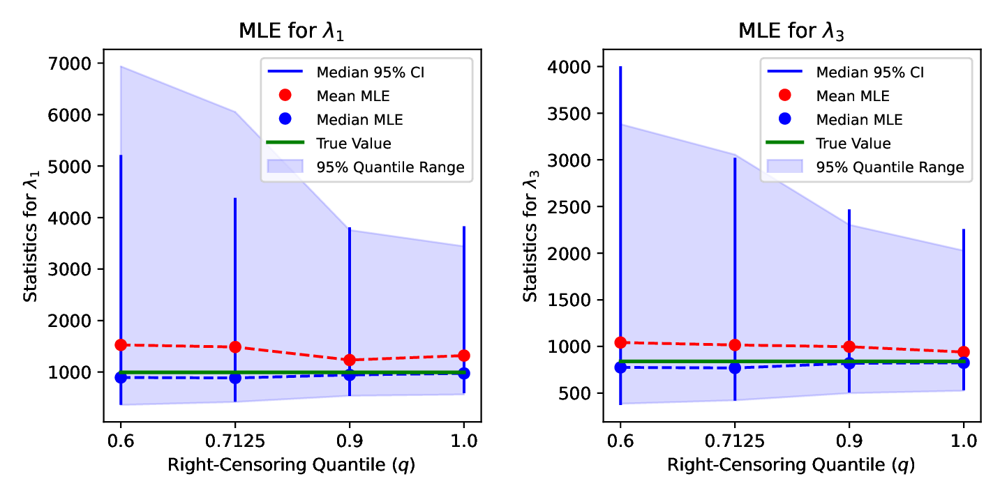

- **Dispersion**: Less censoring improves MLE precision.
  - Most reliable component more affected by censoring.
- **Bias**: MLE *positively* biased; decreases with less censoring.
- **Median CIs**: Tracks MLE dispersion.

---
## Shape Parameters

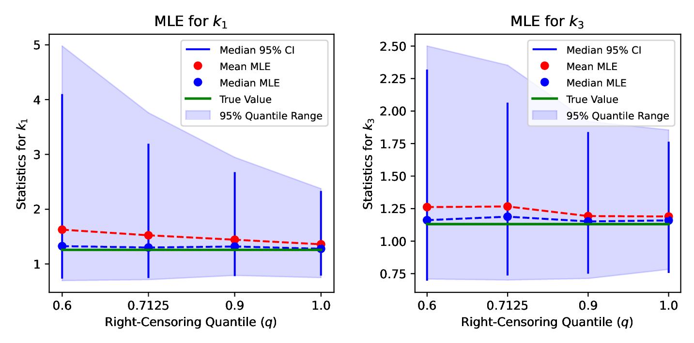

- Show a similar pattern as scale parameters.

---
## Coverage Probability and Convergence Rate

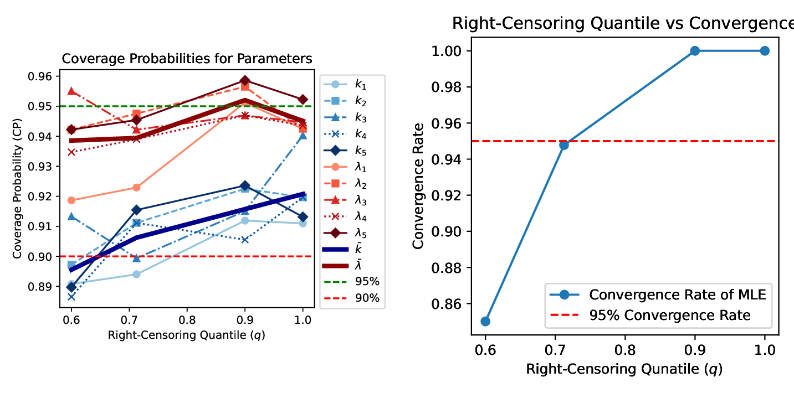

- **Coverage** (left figure): CIs show good empirical coverage.
  - Scale parameters *correctly specified* (CP $\approx 95\%$)
  - Shape parameters *good enough* (CP $> 90\%$).
- **Convergence Rate** (right figure): Increases with less censoring.
  - **Caution**: Dips below $95\%$ with more than $30\%$ censoring.

---
## Key Takeaways: Right-Censoring

Right-censoring has a notable impact on the MLE:

- **MLE Precision**:
  - Improves notably with reduced right-censoring levels.
  - More reliable components benefit more from reduced right-censoring.
- **Bias**:
  - MLEs show positive bias, but decreases with reduced right-censoring.
- **Convergence Rates**:
  - MLE convergence rate improves with reduced right-censoring.
  - Dips: $< 95\%$ at $> 30\%$ right-censoring.

BCa confidence intervals show good empirical coverage.

  - CIs offer reliable *empirical coverage*.
  - Scale parameters *correctly specified* across all right-censoring levels.

---
## Scenario: Impact of Failure Masking

Assessing the impact of the failure masking level on MLE and CIs.

- **Bernoulli Masking Probability**: Vary Bernoulli probability $p$ from $10\%$ to $70\%$.
- **Right-Censoring**: $q$ fixed at $82.5\%$.
  - Right-censoring occurs with probability $1-q$: $17.5\%$.
  - Censoring less prevalent than masking.
- **Sample Size**: $n$ fixed at $90$.
  - Small enough to show impact of masking.

---
### Shape Parameters

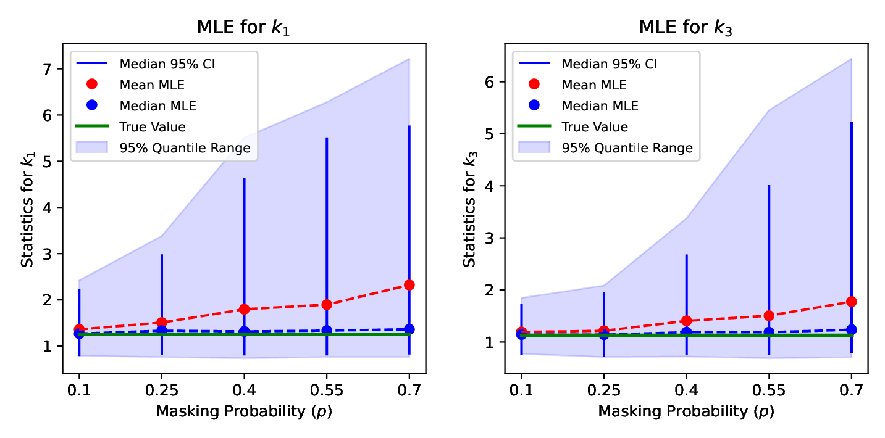

- **Dispersion**: Precision decreases with masking level ($p$).
- **Bias**: MLE *positively* biased and increases with masking level.
  - Applies a right-censoring like effect to the components.
- **Median CIs**: Tracks MLE dispersion.

---
### Scale Parameters

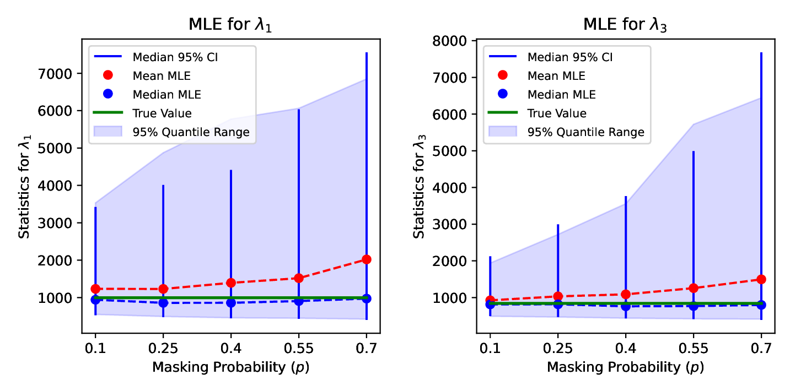

- These graphs resemble the last ones for shape parameters.

---
### Coverage Probability and Convergence Rate

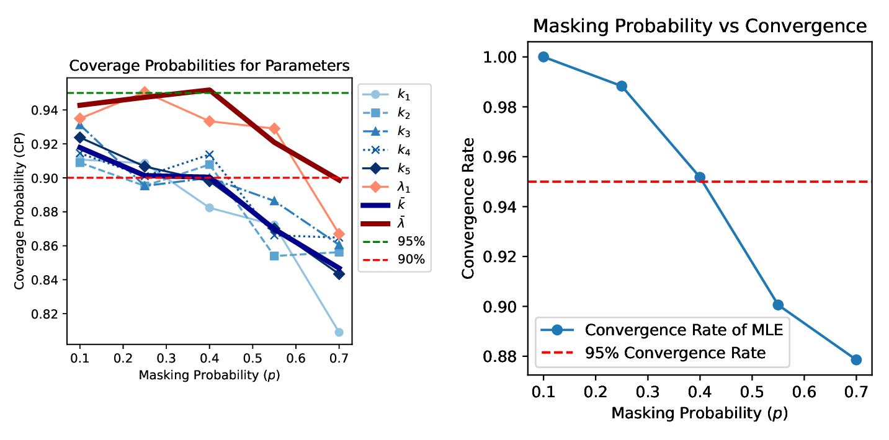

- **Coverage**: Caution advised for severe masking with small samples.
  - Scale parameter CIs show acceptable coverage across all masking levels.
  - Shape parameter CIs dip below $90\%$ when $p > 0.4$.
- **Convergence Rate**: Increases with less masking.
  - **Caution**: Dips under $95\%$ when $p > 0.4$ (consistent with CP behavior).

---
### Key Takeaways: Masking

The masking level of component failures profoundly affects the MLE:

- **MLE Precision**:
  - Decreases with more masking.
- **MLE Bias**:
  - Positive bias is amplified with increased masking.
  - Masking exhibits a right-censoring-like effect.
- **Convergence Rate**:
  - Commendable for Bernoulli masking levels $p \leq 0.4$.
    - *Extreme* masking: some masking occurs $90\%$ of the time at $p = 0.4$.

The BCa confidence intervals show good coverage:

- **Scale** parameters maintain good coverage across all masking levels.
- **Shape** parameter coverage dip below $90\%$ when $p > 0.4$.
  - Caution advised for severe masking with small samples.

---
## Scenario: Impact of Sample Size

Assess the mitigating affects of sample size on MLE and CIs.

- **Sample Size**: We vary the same size $n$ from 50 to 500..
- **Right-Censoring**: $q$ fixed at $82.5\%$
  - $17.5\%$ chance of right-censoring.
- **Bernoulli Masking Probability**: $p$ fixed at $21.5\%$
  - Some masking occurs $62\%$ of the time.

---
### Scale Parameters

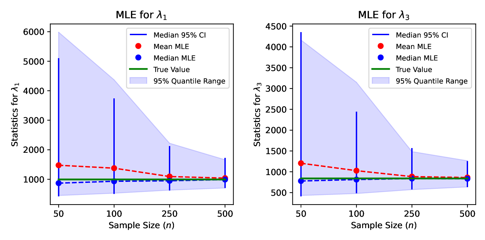

- **Dispersion**: Increasing sample size improves MLE precision.
  - Extremely precise for $n \geq 250$.
- **Bias**: Large *positive* bias initially, but diminishes to zero.
  - Large samples counteract right-censoring and masking effects.
- **Median CIs**: Track MLE dispersion. Very tight for $n \geq 250$.

---
### Shape Parameters

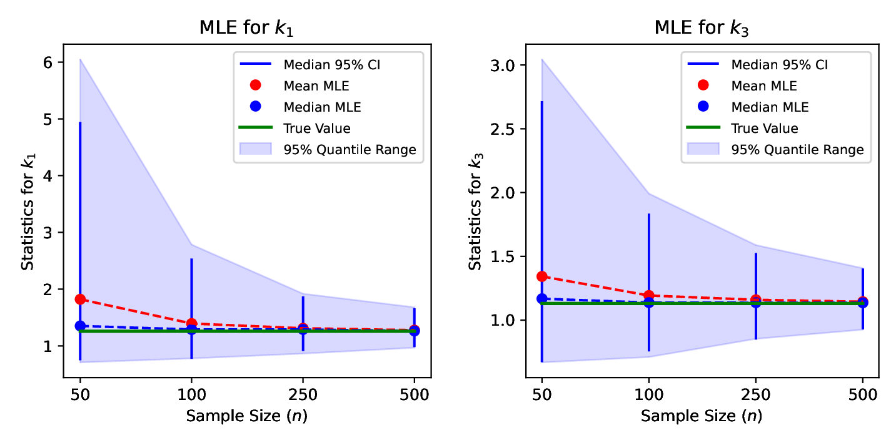

- These graphs resemble the last ones for scale parameters.

---
### Coverage Probability and Convergence Rate

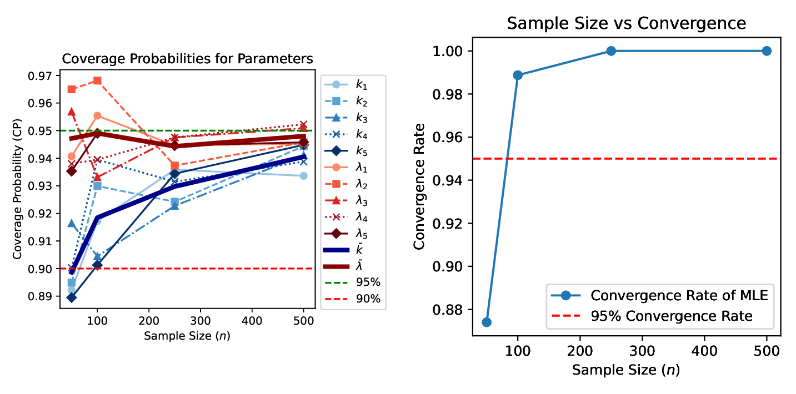

- **Coverage**: Good empirical coverage.
  - Correctly specified CIs for $n > 250$.

- **Convergence Rate**: Total convergence for $n \geq 250$.
  - Caution advised for estimates with $n < 100$ in specific setups.

---
### Key Takeaways: Sample Size

Sample size has a notable impact on the MLE:

- **Precision**: Very precise for large samples ($n > 200$).
- **Bias**: Diminishes to near zero for large samples.
- **Coverage**: Correctly specified CIs for large samples.
- **Convergence Rate**: Total convergence for large samples.

### **Summary** 
Larger samples lead to more accurate, unbiased, and reliable estimations.

  - Mitigates the effects of right-censoring and masking.

---
# Conclusion

**MLE Performance**:

- Right-censoring and masking introduce positive bias for our setup.
  - More reliable components are more affected.
- Shape parameters harder to estimate than scale parameters.
- Large samples can mitigate the affects of masking and right-censoring.

**BCa Confidence Interval Performance**:

- Width of CIs tracked MLE dispersion.
- Good empirical coverage in most scenarios.

### Big Picture
MLE and CIs robust despite masking and right-censoring challenges.

---  
# Future Work and Discussion

Directions to enhance learning from masked data:

- **Relax Masking Conditions**: Assess sensitivity to violations and and explore alternative likelihood models.
- **System Design Deviations**: Assess estimator sensitivity to deviations.
- **Homogenous Shape Parameter**: Analyze trade-offs with the full model.
- **Bootstrap Techniques**: Semi-parametric approaches and prediction intervals.
- **Regularization**: Data augmentation and penalized likelihood methods.
- **Additional Likelihood Contributions**: Predictors, etc.
