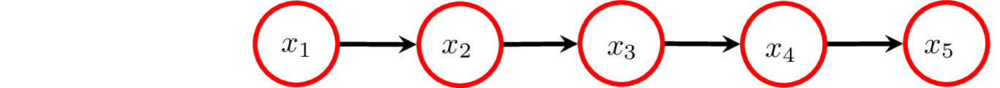
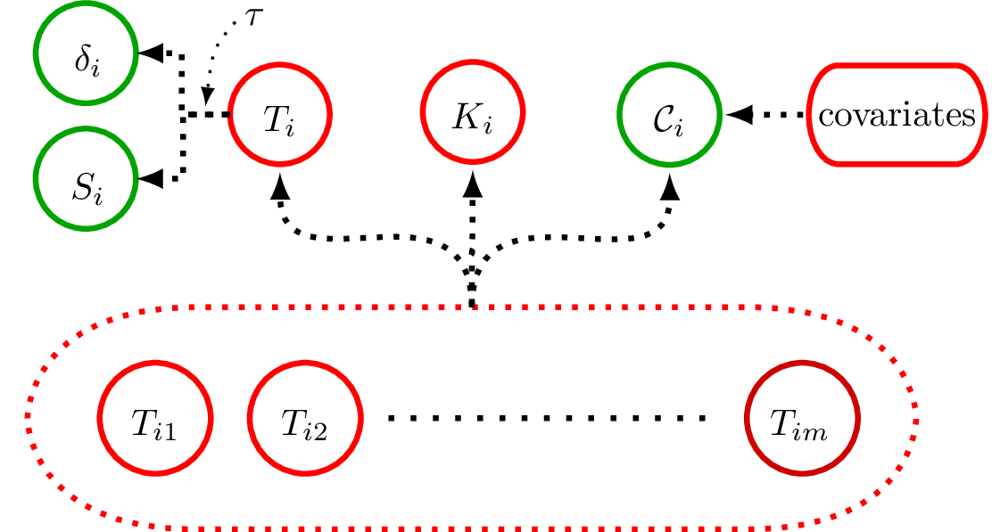
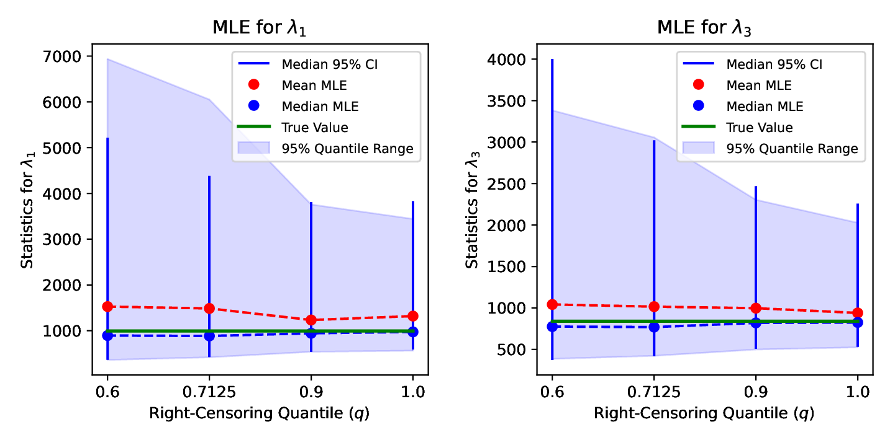
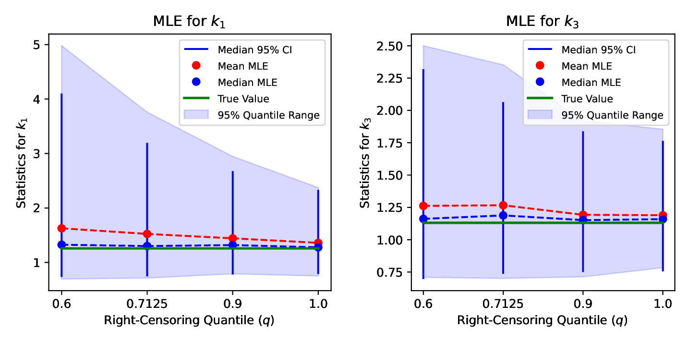
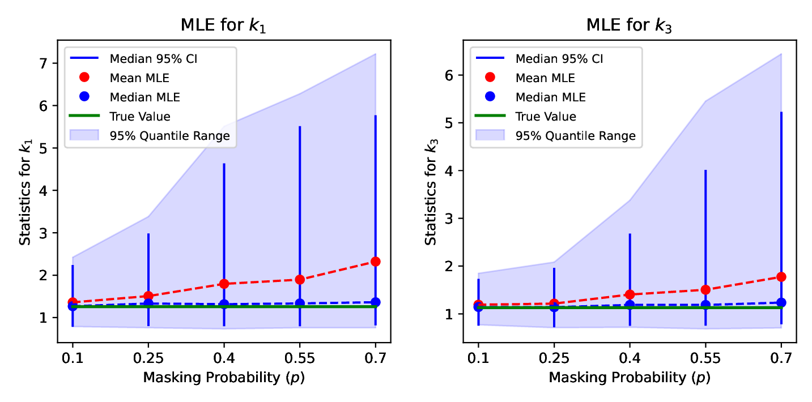
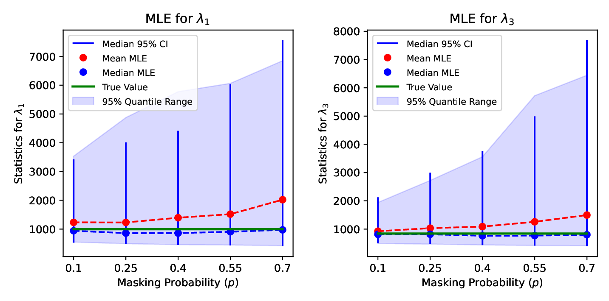

## Context & Motivation

**Reliability** in **Series Systems** is like a chain's strength -- determined
by its weakest link.

- Essential for system design and maintenance.
 
**Main Goal**: Estimate individual component reliability from *failure data*.

**Challenges**:

- *Masked* component-level failure data.
- *Right-censoring* system-level failure data.

**Our Response**:

- Derive techniques to interpret such ambiguous data.
- Aim for precise and accurate reliability estimates for individual components
  using maximum likelihood estimation (MLE)
- Quantify uncertainty in estimates with bootstrap confidence intervals (CIs).

\note{
\begin{itemize}
\item Think of a series system as a \textbf{chain}: reliability is determined by its weakest component.
\item When any component \textbf{fails}, the whole system does.
\item So, understanding the \textbf{reliability} of each component is needed for
the \textbf{design} and \textbf{maintenance} of these systems. 
\item So, our \textbf{main goal} is to estimate the reliability of each component
from failure data.
\item But the \textbf{data} can pose \textbf{challenges}, like right-censoring or masked failures where we don't know which component failed.
\item Our \textbf{goal} is to use this data to estimate the reliability of each component,
and quantify the uncertainty in our estimates with confidence intervals.
\item To obtain good \textbf{coverage}, we bootstrap the confidence intervals using the \textbf{BCa method}.
\end{itemize}
}

## Core Contributions

**Likelihood Model** for **Series Systems**.

- Accounts for *right-censoring* and *masked component failure*.

**Specifications of Conditions**:

- Assumptions about the masking of component failures.
- Simplifies and makes the model more tractable.

**Simulation Studies**:

- Components with *Weibull* lifetimes.
- Evaluate MLE and confidence intervals under different scenarios.

**R Library**: Methods available on GitHub.

- See: [www.github.com/queelius/wei.series.md.c1.c2.c3](https://github.com/queelius/wei.series.md.c1.c2.c3)

\note{
\begin{itemize}
\item Our \textbf{core contributions} can be broken down into several parts.
\item We \textbf{derived} a \textbf{likelihood model} for series systems that accounts for
\textbf{Right-censoring} and \textbf{masking} of \textbf{component failures}.
\item We've \textbf{clarified} the conditions this model assumes about the masking of component failures. These conditions simplify the model and make it more tractable.
\item We've \textbf{validated} our model with extensive simulations to gauge its performance under various simulation scenarios.
\item The \textbf{simulation study} is based on components with \textbf{Weibull} lifetimes.
\item For those interested, we made our methods available in an \textbf{R Library} hosted on GitHub.
\end{itemize}
}

# Series System

## What Is A Series System?

```{r, out.width='70%', fig.align='center', echo=FALSE}

```

**Critical Components**: Complex systems often comprise *critical* components.
If any component fails, the entire system fails.

- We call such systems *series systems*.
- **Example**: A car's engine and brakes.

**System Lifetime** is dictated by its shortest-lived component:
$$
T_i = \min(T_{i 1}, \ldots, T_{i 5})
$$
where:

- $T_i$ is the lifetime of $i$\textsuperscript{th} system.
- $T_{i j}$ is the $j$\textsuperscript{th} component of $i$\textsuperscript{th} system.

\note{
\begin{itemize}
\item Many complex systems have \textbf{critical components} that are essential to their operation.
\item If any of these components fail, the entire system fails. We call these \textbf{series systems}.
\item Think of a \textbf{car} - if the engine or brakes fail, it can't be operated.
\item Its \textbf{lifetime} is the lifetime of its \textbf{shortest-lived} component.
\item For reference, we show the some notation we'll use throughout the talk.
\item $T_i$ is the system's lifetime and $T_{i j}$ is its $j$\textsuperscript{th} component's lifetime.
\end{itemize}
}

## Reliability Function
**Reliability Function** represents the probability that a system or component functions
beyond a specified time.

- Essential for understanding longevity and dependability.

**Series System Reliability**: Product of the reliability of its components:
$$
R_{T_i}(t;\v\theta) = \prod_{j=1}^m R_j(t;\v{\theta_j}).
$$

- If any component has low reliability, it can impact the whole system.
- Here, $R_{T_i}(t;\v\theta)$ and $R_j(t;\v{\theta_j})$ are the reliability
  functions for the system $i$ and component $j$, respectively.

\note{
\begin{itemize}
\item The \textbf{reliability function} tells us the chance a component or system has a lifetime beyond a specified time.
\item It's a \textbf{key metric} in reliability studies, as it helps us understand the longevity and dependability of a system.
\item In a series system, the overall reliability is the \textbf{product} of its \text{component reliabilities}.
\item So, even if \textbf{one component} has a low reliability, it can impact the whole system.
\item For notation, we denote the reliability function for the system as $R_{T_i}$ and the reliability function for the $j$\textsuperscript{th} component as $R_j$.
\end{itemize}
}

## Hazard Function: Understanding Risks

**Hazard Function**: Measures the immediate risk of failure at a given time,
assuming survival up to that moment.

- Reveals how the risk of failure evolves over time.
- Guides maintenance schedules and interventions.

**Series System Hazard Function**: Sum of the component hazard functions:
$$
h_{T_i}(t;\v{\theta}) = \sum_{j=1}^m h_j(t;\v{\theta_j}).
$$

- Components' risks are additive.

\note{
\begin{itemize}
\item Moving into the hazard function, it measures the immediate risk of failure at a given time, assuming survival up to that moment.
\item The hazard function for a series system is just the \text{sum} of the \textbf{component hazards}.
\item We see that the component risks are \textbf{additive}.
\item For notation, we denote the hazard function for the system as $h_{T_i}$ and the hazard function for the $j$\textsuperscript{th} component as $h_j$.
\end{itemize}
}

## Joint Distribution of Component Failure and System Lifetime
Our likelihood model depends on the **joint distribution** of the system
lifetime and the component that caused the failure.

- **Formula**: Product of the failing component's hazard function and the system
reliability function:
$$
f_{K_i,T_i}(j,t;\v\theta) = h_j(t;\v{\theta_j}) R_{T_i}(t;\v\theta).
$$
- Here, $K_i$ denotes component cause of $i$\textsuperscript{th} system's failure.

\note{
\begin{itemize}
\item In our likelihood model, understanding the \textbf{joint distribution} of
a system's lifetime and the component that led to its failure is essential.
\item It is the \textbf{product} of the failed component's hazard function and
the system reliability function.
\item Here, $K_i$ denotes the \textbf{failed component} of the $i$\textsuperscript{th} system.
\end{itemize}
}


## Component Cause of Failure

We can use the joint distribution to calculate the probability of component
cause of failure.

- Helps predict the cause of failure.
- **Derivation**: Marginalize the joint distribution over the system lifetime:
$$
\Pr\{K_i = j\} = E_{\v\theta} \biggl[ \frac{h_j(T_i;\v{\theta_j})} {h_{T_i}(T_i ; \v{\theta_l})} \biggr].
$$
- **Well-Designed Series System**: Components exhibit comparable chances of
causing system failures.
- **Relevance**: Our simulation study employs a (reasonably) well-designed
series system.

\note{
\begin{itemize}
\item We can use the \textbf{joint distribution} of the system lifetime and the failed component to calculate the probability of each component causing the failure.
\item This helps us \textbf{predict} the cause of failure.
\item It is \textbf{derived} by marginalizing the joint distribution over the system lifetime.
\item When we do so, we find that it is the \textbf{expected value} of the ratio of component and system hazard functions.
\item We say that a series system is \textbf{well-designed} if each components has a \textbf{comparable} chance of failing.
\item Our simulation study is \textbf{based} on a reasonably well-designed series system.
\end{itemize}
}

# Likelihood Model

## Data Generating Process

The data generating process (DGP) is the underlying process that generates the data.
*Green* elements are observed, *red* elements are latent:

- **Right-Censored** lifetime: $S_i = \min(T_i, \tau_i)$.
- **Event Indicator**: $\delta_i = 1_{\{T_i < \tau_i\}}$.
- **Candidate Set**: $\mathcal{C}_i$ related to components ($T_{i j})$
  and other unknowns.


```{r graph-model, echo=FALSE, fig.align='center', out.width='50%'}

```


\note{
\begin{itemize}
\item Let's discuss the \textbf{data generating process} to motivate our likelihood model.
\item Here's the graph: \textbf{green} elements are observed and \textbf{red} elements are latent.
\item We don't get to see the red elements, but we can make \textbf{inferences} about them from information in the green elements.
\item Let's focus on the \textbf{green} elements.
\item \emph{Discuss graph.}
\end{itemize}
}


## Likelihood Function

**Likelihood Function** measures how well model explains the data:

- **Right-Censored** data ($\delta_i = 0$).
- **Candidate Sets** or **Masked Failure** data ($\delta_i = 1$)

System | Right-Censored Lifetime ($S_i$) | Event Indicator ($\delta_i$) | Candidate Set ($\mathcal{C}_i$) |
------ | ----------------------- | --------------- | -------------- |
   1   | $1.1$                   | 1               | $\{1,2\}$      |
   2   | $5$                     | 0               | $\emptyset$    |

Each system contributes to *total likelihood* via its *likelihood contribution*:
$$
L(\v\theta|\text{data}) = \prod_{i=1}^n L_i(\v\theta|\text{data}_i)
$$
where **data$_i$** is data for $i$\textsuperscript{th} system and $L_i$ is its contribution.

\note{
\begin{itemize}
\item Let's talk about the \textbf{likelihood function}, which is a way of \textbf{measuring} how well our model explains the data.
\item Our model deals with boths kinds of \textbf{data} mentioned in our previous slide, right-censoring and masked failures or candidate sets.
\item \emph{Discuss Table}
\item We use the concept of a \textbf{total likelihood}, which is the product of the likelihood contributions of each type of data.
\item The \textbf{total likelihood} is the product of these likelihood contributions.
\item We're going to derive the likelihood contributions for each of these types of data.
\end{itemize}
}

## Likelihood Contribution: Right-Censoring

**Right-Censoring**: For the $i$\textsuperscript{th} system, if right-censored ($\delta_i = 0$)
at duration $\tau$, its likelihood contribution is proportional to the system reliability function evaluated at $\tau$:
$$
L_i(\v\theta) \propto R_{T_i}(\tau;\v\theta).
$$

- We only know that a failure occurred after the right-censoring time.
- This is captured by the system reliability function.

**Key Assumptions**:

- Censoring time ($\tau$) independent of parameters.
- Event indicator ($\delta_i$) is observed.
- **Reasonable** in many cases, e.g., right-censoring time $\tau$ predetermined by length of study.

\note{
\begin{itemize}
\item When a system is \textbf{right-censored}, its likelihood contribution is proportional to the system reliability evaluated at the right-censoring time.
\item This is because we only know that the system lasted longer than the right-censoring time.
\item This information is \textbf{captured} by that function.
\item In our model, we \textbf{assume} that the right-censoring time is independent of the system parameter and that the event indicator is observed.
\item These are \textbf{reasonable} assumptions in many cases, like when the right-censoring time is predetermined by the length of a study.
\end{itemize}
}

## Likelihood Contribution: Candidate Sets

**Masking Component Failure**: If the $i$\textsuperscript{th} system fails ($\delta_i = 1$),
it is masked by a candidate set $\mathcal{C}_i$. Its likelihood contribution is complex and
we use simplifying assumptions to make it tractable.

- **Condition 1**: The candidate set includes the failed component: $\Pr\{K_i \in \mathcal{C}_i\} = 1$.

- **Condition 2**: The condition probability of a candidate set given a cause of failure and a system lifetime is constant across conditioning on different failure causes within the candidate set: $\Pr\{\mathcal{C}_i = c_i | T_i = t_i, K_i = j\} = \Pr\{\mathcal{C}_i = c_i | T_i = t_i, K_i = j'\}$ for $j,j' \in c_i$.

- **Condition 3**: The masking probabilities when conditioned on the system lifetime and the failed component aren't functions of the system parameter.

\note{
\begin{itemize}
\item When a system is \textbf{masked} by a \textbf{candidate set}, its likelihood contribution is more complex.
\item We use \textbf{3 conditions} to make the problem more tractable.
\item In \textbf{Condition 1}, the candidate set always includes the failed component.
\item In \textbf{Condition 2}, the probability of the candidate set is constant across different components within it.
\item In \textbf{Condition 3}, the masking probabilities when conditioned on the system lifetime and the failed component aren't functions of the system parameter.
\item These conditions are often \textbf{reasonable} in industrial settings.
\end{itemize}
}

## Likelihood Contribution: Derivation for Candidate Sets

Take the **joint distribution** of $T_i$, $K_i$, and $\mathcal{C}_i$ and marginalize over $K_i$:
$$
f_{T_i,\mathcal{C}_i}(t_i,c_i;\v{\theta}) = \sum_{j=1}^m f_{T_i,K_i}(t_i,j;\v{\theta})\Pr{}_{\!\v\theta}\{\mathcal{C}_i = c_i | T_i = t_i, K_i = j\}.
$$
Apply **Condition 1** to get a sum over candidate set:
$$
f_{T_i,\mathcal{C}_i}(t_i,c_i;\v{\theta}) = \sum_{j \in c_i} f_{T_i,K_i}(t_i,j;\v\theta)\Pr{}_{\!\v\theta}\{\mathcal{C}_i = c_i | T_i = t_i, K_i = j\}.
$$
Apply **Condition 2** to move probability outside the sum:
$$
f_{T_i,\mathcal{C}_i}(t_i,c_i;\v{\theta}) = \Pr{}_{\!\v\theta}\{\mathcal{C}_i = c_i | T_i = t_i, K_i = j'\} \sum_{j \in c_i} f_{T_i,K_i}(t_i,j;\v\theta).
$$
Apply **Condition 3** to remove the probability's dependence on $\v\theta$:
$$
f_{T_i,\mathcal{C}_i}(t_i,c_i;\v{\theta}) = \beta_i \sum_{j \in c_i} f_{T_i,K_i}(t_i,j;\v\theta).
$$
**Result**: $L_i(\v\theta) \propto \sum_{j \in c_i} f_{T_i,K_i}(t_i,j;\v\theta) = R_{T_i}(t_i;\v\theta) \sum_{j \in c_i} h_j(t_i;\v{\theta_j})$.

\note{
\begin{itemize}
\item Here, we \textbf{derive} the likelihood contribution for masked failures.
\item To start, we use the \textbf{joint distribution} of the system lifetime, the failed component, and the candidate set.
\item Then, we \textbf{marginalize} over the failed component, since we don't know which component failed.
\item We apply \textbf{condition 1} to get a \textbf{sum} over the \textbf{candidate set} instead.
\item We apply \textbf{condition 2} to move the probability \textbf{outside} the sum.
\item We apply \textbf{condition 3} to \textbf{remove} the probability's dependence on the system parameter.
\item We \textbf{end up} with a likelihood contribution proportional to the product of the system reliability and the sum of the component hazards in the candidate set.
\end{itemize}
}

## Bootstrap Confidence Intervals (CIs)

**Confidence Intervals (CI)** help capture the *uncertainty* in our estimate.

- **Normal** assumption for constructing CIs may not be accurate.
  - *Masking* and *censoring*.
- **Bootstrapped CIs**: Resample data and obtain MLE for each.
  - Use **percentiles** of bootstrapped MLEs for CIs.
- **Coverage Probability**: Probability the interval covers the true parameter value.
  - **Challenge**: Actual coverage may deviate to bias and skew in MLEs.
- **BCa** adjusts the CIs to counteract bias and skew in the MLEs.

\note{
\begin{itemize}
\item We need to measure the \textbf{uncertainty} in our estimate.
\item \textbf{Confidence intervals} are a popular choice and help us pin down the likely range of values for our parameters.
\item Due to masking and censoring, the \textbf{normal} approximation for constructing CIs may be inaccurate.
\item We've chosen to \textbf{bootstrap} the intervals instead, which isn't as sensitive to these issues.
\item \textbf{Coverage probability} is the probability the interval covers the true parameter value.
\item Due to bias and skew in the MLE, the coverage probability may be too low/high, indicating over/under confidence.
\item We use the \textbf{BCa method} to adjust the confidence intervals to counteract bias and skew.
\end{itemize}
}

## Challenges with Masked Data

Like any model, ours has its challenges:

- **Convergence Issues**: Nearly flat likelihood regions can occur.
  - Ambiguity in masked, censored data
  - Complexities of estimating latent parameters.

- **Bootstrap Issues**: Relies on the empirical sampling distribution.
  - May not represent true variability for small samples.
  - *Censoring* and *masking* compound issue by reducing the **effective** sample size.

- **Mitigation**: In simulation, discard non-convergent samples for MLE on
  original data but retain all resamples for CIs.
  - More robust assessment at the cost of possible bias towards "well-behaved" data.  
  - **Convergence Rates** reported to provide context.

\note{
\begin{itemize}
\item We use the standard \textbf{maximum likelihood approach} to estimate the parameters.
\item But, like any model, ours has its challenges, such as nearly flat likelihood regions due to ambiguity in \textbf{masked data} and the complexities of estimating \textbf{latent} component parameters, complicating the convergence of the MLE.
\item Also, for the confidence intervals, \textbf{bootstrapping} relies on empirical sampling, which may not capture the true variability in the data for small samples.
\item However, we \textbf{keep} all the resamples for computing confidence intervals.
\item To \textbf{deal} with these issues in the simulation study, we discard non-convergent samples for the \text{MLE} on the original synthetic data but retain all resamples for computing our confidence intervals.
\item This offers a more \textbf{robust assessment} but at the cost of possible bias towards "well-behaved" data.
\item Finally, we report \textbf{convergence rates} to provide context for the reliability of our estimates.
\end{itemize}
}

# Simulation Study: Series System with Weibull Components

## Series System Parameters

| Component | Shape $(k_j)$ | Scale ($\lambda_j$) | Failure Probability ($\Pr\{K_i\}$) |
|-----------|-------|--------|--------------|
| 1         | 1.26  | 994.37 | 0.17         |
| 2         | 1.16  | 908.95 | 0.21         |
| 3         | 1.13  | 840.11 | 0.23         |
| 4         | 1.18  | 940.13 | 0.20         |
| 5         | 1.20  | 923.16 | 0.20         |

**Lifetime** of $j$\textsuperscript{th} component of $i$\textsuperscript{th} system: $T_{i j} \sim \operatorname{Weibull}(k_j,\lambda_j)$.

- Based on (Guo, Niu, and Szidarovszky 2013)
- Extended to include components 4 and 5
  - Shapes greater than 1 indicates wear-outs.
  - Probabilities comparable: reasonably **well-designed**.
- Focus on Components 1 and 3 (most and least reliable) in study.

\note{
\begin{itemize}
\item This study is \textbf{centered} around the series system shown in the table.
\item It's \textbf{based} on a 2013 study that analyzed a 3-component system.
\item We \textbf{added} components 4 and 5 to introduce complexity.
\item We chose the \textbf{Weibull} for the component lifetimes, which is characterized by \textbf{shape} and \textbf{scale} parameters.
\item The table shows the \textbf{shape} and \textbf{scale} parameters for each component in the system.
\item The \textbf{shape} parameters are \textbf{greater} than 1, which indicate \textbf{wearing-out}.
\item We also show the \textbf{probability} of each component being the cause of failure in the last column.
\item The system is  \textbf{well-designed}, as evidenced by comparable probabilities.
\item In our simulation, we pay special attention to components 1 and 3, the most and least reliable components, as they show the biggest differences.
\end{itemize}
}

## Synthetic Data and Simulation Values

How is the data generated in our simulation study?

- **Component Lifetimes** (latent $T_{i 1}, \cdots, T_{i m}$) generated for each system.
  - **Observed Data** is a function of latent components.
- **Right-Censoring** amount controlled with simulation value $q$.
  - Quantile $q$ is probability system won't be right-censored.
  - Solve for right-censoring time $\tau$ in $\Pr\{T_i \leq \tau\} = q$.
  - $S_i = \min(T_i, \tau)$ and $\delta_i = 1_{\{T_i \leq \tau\}}$.
- **Candidate Sets** are generated using the *Bernoulli Masking Model*.
  - Masking level controlled with simulation value $p$.
  - Failed component (latent $K_i$) placed in candidate set (observed $\mathcal{C}_i$).
  - Each functioning component included with probability $p$.

\note{
\begin{itemize}
\item Let's talk about how we \textbf{generate} the data for our \textbf{simulation} study.
\item First, we generate the latent \textbf{component lifetimes} for the system just discussed.
\item Then, we generate the data we actually \textbf{see} based on these lifetimes.
\item The \textbf{right-censored} lifetimes, the \textbf{censoring indicators}, and \textbf{candidate sets}.
\item In the simulations, we \textbf{control} the amount of \textbf{right-censoring} with the value $q$, the probability the system won't be right-censored.
\item We use the \textbf{Bernoulli Masking Model} to generate the candidate sets.
\item We \textbf{control} the masking level with the value $p$, the \textbf{Bernoulli} probability.
\item -- Explain procedure for generating candidates --
\end{itemize}
}

## Bernoulli Masking Model: Satisfying Masking Conditions

The Bernoulli Masking Model *satisfies* the masking conditions:

- **Condition 1**: The failed component deterministically placed in candidate set. 
- **Condition 2** and **3**: Bernoulli probability $p$ is same for all components
and fixed by us.
  - Probability of candidate set is constant conditioned on component failure within set.
  - Probability of candidate set, conditioned on a component failure, only
    depends on the $p$.

**Future Research**: Realistically conditions may be violated.

  - Explore sensitivity of likelihood model to violations.

\note{
\begin{itemize}
\item It's important to show how our \textbf{Bernoulli} masking model used in our simulation study \textbf{satisfies} these masking conditions.
\item We obviously satisfy \textbf{Condition 1} because the failed component is always placed in the candidate set.
\item We satisfy \textbf{Condition 2} because the Bernoulli probability is the same for all components. As
we vary the component failure within the set, the probability of the set doesn't change.
\item We satisfy \textbf{Condition 3} because, conditioned on a failed component,
the probability of the candidate set only depends on the Bernoulli probability, which is fixed by us and doesn't interact with the the system parameters.
\item In \textbf{real life}, these conditions may be violated. Future research could explore the \textbf{sensitivity} of our likelihood model to violations of these conditions.
\end{itemize}
}

## Performance Metrics

**Objective**: Evaluate the MLE and BCa confidence intervals' performance across
various scenarios.

- Visualize the **simulated** sampling distribution of MLEs and $95\%$ CIs.
- **MLE Evaluation**:
  - **Accuracy**: Bias 
  - **Precision**: Dispersion of MLEs
    - $95\%$ quantile range of MLEs.
- **95\% CI Evaluation**:
  - **Accuracy**: Coverage probability (CP).
    - *Correctly Specified* CIs: CP near $95\%$ ($>90\%$ acceptable).
  - **Precision**: Width of median CI.
  

\note{
\begin{itemize}
\item We want to evaluate the accuracy and precision of our MLE and CIs under
various conditions.
\item For the \textbf{MLE}, we're looking at its \textbf{bias} and \textbf{spread}.
\item A \textbf{tight spread} indicates \textbf{high precision}, but if it's biased, we can't trust it.
\item For the \textbf{CIs}, when we talk about accuracy, we're looking at \textbf{coverage probability}.
\item We want our intervals to be \textbf{correctly specified}, meaning they cover the true parameter value around $95\%$ of the time.
\item Our \textbf{goal} is to get close to the nominal $95\%$ level, but we'll consider anything above 90% acceptable.
\item As for \textbf{precision}, we use the width of these intervals.
\item A \textbf{narrow width} points to a \textbf{higher precision}, but that's meaningless if the CP is too low.
\item \textbf{Accuracy} and \textbf{precision} are needed for confidence in the estimate.
\end{itemize}
}

## Scenario: Impact of Right-Censoring

Assess the impact of right-censoring on MLE and CIs.

- **Right-Censoring**: Failure observed with probability $q$: $60\%$ to $100\%$.
  - Right censoring occurs with probability $1-q$: $40\%$ to $0\%$.
- **Bernoulli Masking Probability**: Each component is a candidate with probability $p$ fixed at $21.5\%$.
  - Estimated from original study (Guo, Niu, and Szidarovszky 2013).  
- **Sample Size**: $n$ fixed at $90$.
  - Small enough to show impact of right-censoring.

\note{
\begin{itemize}
\item We assess the impact of \textbf{right-censoring} on the MLE and confidence intervals.
\item We \textbf{vary} the probability of observing a failure from $60\%$ to $100\%$.
\item We fix the masking probability at $21.5\%$, which is the probability that each component is a candidate.
\item This masking probability is \textbf{based} on estimates from a 2013 study.
\item We fix the \textbf{sample size} at 90, which was small enough to show the
impact of right-censoring on the MLE, but large enough so that the convergence rate was reasonable.
\end{itemize}
}

## Scale Parameters

```{r fig-scale-tau, echo=F, out.width="100%", fig.align="center"}


```

- **Dispersion**: Less censoring improves MLE precision.
  - Most reliable component more affected by censoring.
- **Bias**: MLE *positively* biased; decreases with less censoring.
- **Median CIs**: Tracks MLE dispersion.

\note{
\begin{itemize}
\item Here, we show two graphs for the \textbf{scale parameters} of the two components, the most reliable on the left and the least reliable on the right.
\item In \textbf{light solid blue}, we show the dispersion of the MLE. We see that it improves with less censoring.
\item We see that the \textbf{more reliable} component has more dispersion than the other component.
\item This is \textbf{due} to more reliable components being more likely to be censored.
\item In the \textbf{dashed red line}, we show the mean of the MLEs. In green, we show the true values.
\item The MLEs are \textbf{positively} biased, but that bias decreases as censoring level is reduced.
\item In the \textbf{dark blue} vertical lines, we show the \text{medians} of the confidence intervals.
\item We see they they \textbf{track} the MLE's dispersion, which is good.
\end{itemize}
}


## Shape Parameters

```{r fig-shape-tau, echo=F, out.width="100%", fig.align="center"}

```

- Show a similar pattern as scale parameters.

\note{
\begin{itemize}
\item We see similar results for the \textbf{shape parameters}.
\item So, let's move on to evaluating the \textbf{accuracy} of the
\textbf{confidence intervals}, where we do see some notable differences.
\end{itemize}
}

## Coverage Probability and Convergence Rate

\begin{figure}
\begin{minipage}{.5\textwidth}
```{r fig-tau-cp, echo=F, out.width="\\linewidth", fig.align="center"}
knitr::include_graphics("../image/plot-q-vs-cp.pdf")
```
\end{minipage}%
\begin{minipage}{.4\textwidth}
```{r fig-tau-conv, echo=F, out.width="\\linewidth", fig.align="center"}
knitr::include_graphics("../image/q_vs_convergence.pdf")
```
\end{minipage}
\end{figure}

- **Coverage** (left figure): CIs show good empirical coverage.
  - Scale parameters *correctly specified* (CP $\approx 95\%$)
  - Shape parameters *good enough* (CP $> 90\%$).
- **Convergence Rate** (right figure): Increases with less censoring.
  - \textbf{Caution}: Dips below $95\%$ with more than $30\%$ censoring.

\note{
\begin{itemize}
\item On the \textbf{left} figure, we show the impact of
\textbf{right-censoring} on the \textbf{coverage probability}.
\item In the \textbf{bold} red line, we show the \textbf{mean} coverage for the
scale parameters.
\item It shows that the \textbf{coverage} is \textbf{correctly specified} across
all censoring levels.
\item In the \textbf{bold} blue line, we show the \textbf{mean} coverage for the
shape parameters. They are \textbf{acceptable}, with coverage above $90\%$.
\item In the \textbf{right} figure, we show the \textbf{convergence rate} for
the MLE.
\item At more than $30\%$ censoring, the convergence rate dips below $95\%$.
\item Combined with moderate failure masking and small samples, we suggest
\textbf{caution} in interpreting the results.
\end{itemize}
}

## Key Takeaways: Right-Censoring

Right-censoring has a notable impact on the MLE:

- **MLE Precision**:
  - Improves notably with reduced right-censoring levels.
  - More reliable components benefit more from reduced right-censoring.
- **Bias**:
  - MLEs show positive bias, but decreases with reduced right-censoring.
- **Convergence Rates**:
  - MLE convergence rate improves with reduced right-censoring.
  - Dips: $< 95\%$ at $> 30\%$ right-censoring.

BCa confidence intervals show good empirical coverage.

  - CIs offer reliable *empirical coverage*.
  - Scale parameters *correctly specified* across all right-censoring levels.

## Scenario: Impact of Failure Masking

Assessing the impact of the failure masking level on MLE and CIs.

- **Bernoulli Masking Probability**: Vary Bernoulli probability $p$ from $10\%$ to $70\%$.
- **Right-Censoring**: $q$ fixed at $82.5\%$.
  - Right-censoring occurs with probability $1-q$: $17.5\%$.
  - Censoring less prevalent than masking.
- **Sample Size**: $n$ fixed at $90$.
  - Small enough to show impact of masking.

\note{
\begin{itemize}
\item Here, we assess the impact of \textbf{masking levels} on the MLE and confidence intervals.
\item We \textbf{vary} the Bernoulli masking probability from $10\%$ to $70\%$.
\item We fix the right-censoring probability at $17.5\%$.
\item The \textbf{chances} of \textbf{censoring} are less than masking.
\item We fix the \textbf{sample size} at $90$, which was small enough to show the
impact of masking on the MLE, but large enough so that the convergence rate was reasonable.
\end{itemize}
}

## Shape Parameters


```{r fig-shape-mask, echo=F, out.width="100%", fig.align="center"}

```


- **Dispersion**: Precision decreases with masking level ($p$).
- **Bias**: MLE *positively* biased and increases with masking level.
  - Applies a right-censoring like effect to the components.
- **Median CIs**: Tracks MLE dispersion.


\note{
\begin{itemize}
\item Here, we show the impact of \textbf{masking} on the MLE and
confidence intervals, this time for the \textbf{shape parameters}.
\item In \textbf{light solid blue}, we show the dispersion of the MLE. We see that as increases with masking level.
\item Unlike for the scale parameter, the \textbf{more reliable} component on the left has only slightly more dispersion than the other component.
\item In the \textbf{dashed red line}, we show the bias. The MLE is \textbf{positively} biased, and increases with masking level.
\item In the \textbf{dark blue} vertical lines, we show the \text{median} confidence intervals.
\item Again, we see they they \textbf{track} the MLE's dispersion.
\end{itemize}
}

## Scale Parameters

```{r fig-scale-mask, echo=F, out.width="100%", fig.align="center"}

```

- These graphs resemble the last ones for shape parameters.

\note{
\begin{itemize}
\item We see similar results for the \textbf{scale parameters}.
\item So, let's move on to evaluating the \textbf{accuracy} of the
\textbf{confidence intervals}, where we do continue to see some differences.
\end{itemize}
}

## Coverage Probability and Convergence Rate

\begin{figure}
\begin{minipage}{.5\textwidth}
```{r fig-p-cp, echo=F, out.width="\\linewidth", fig.align="center"}
knitr::include_graphics("../image/plot-p-vs-cp.pdf")
```
\end{minipage}%
\begin{minipage}{.4\textwidth}
```{r fig-p-conv, echo=F, out.width="\\linewidth", fig.align="center"}
knitr::include_graphics("../image/p_vs_convergence.pdf")
```
\end{minipage}
\end{figure}


- **Coverage**: Caution advised for severe masking with small samples.
  - Scale parameter CIs show acceptable coverage across all masking levels.
  - Shape parameter CIs dip below $90\%$ when $p > 0.4$.
- **Convergence Rate**: Increases with less masking.
  - \textbf{Caution}: Dips under $95\%$ when $p > 0.4$ (consistent with CP behavior).


## Key Takeaways: Masking

The masking level of component failures profoundly affects the MLE:

- **MLE Precision**:
  - Decreases with more masking.
- **MLE Bias**:
  - Positive bias is amplified with increased masking.
  - Masking exhibits a right-censoring-like effect.
- **Convergence Rate**:
  - Commendable for Bernoulli masking levels $p \leq 0.4$.
    - *Extreme* masking: some masking occurs $90\%$ of the time at $p = 0.4$.

The BCa confidence intervals show good coverage:

- **Scale** parameters maintain good coverage across all masking levels.
- **Shape** parameter coverage dip below $90\%$ when $p > 0.4$.
  - Caution advised for severe masking with small samples.

## Scenario: Impact of Sample Size

Assess the mitigating affects of sample size on MLE and CIs.

- **Sample Size**: We vary the same size $n$ from 50 to 500..
- **Right-Censoring**: $q$ fixed at $82.5\%$
  - $17.5\%$ chance of right-censoring.
- **Bernoulli Masking Probability**: $p$ fixed at $21.5\%$
  - Some masking occurs $62\%$ of the time.

\note{
\begin{itemize}
\item We want to see how will the \textbf{sample size} can mitigate the
affects of right-censoring and masking previously discussed.
\item We \textbf{vary} the samples from sizes 50 to 500.
\item We fix the masking probability at $21.5\%$ and the right-censoring probability at $17.5\%$, same as before.
\end{itemize}
}

## Scale Parameters

\begin{figure}
\begin{minipage}{.5\textwidth}
```{r fig-scale-n-1, echo=F, out.width=".95\\linewidth", fig.align="center"}
knitr::include_graphics("../image/plot-n-vs-scale.1-mle.pdf")
```
\end{minipage}%
\begin{minipage}{.5\textwidth}
```{r fig-scale-n-3, echo=F, out.width=".95\\linewidth", fig.align="center"}
knitr::include_graphics("../image/plot-n-vs-scale.3-mle.pdf")
```
\end{minipage}
\end{figure}

- **Dispersion**: Increasing sample size improves MLE precision.
  - Extremely precise for $n \geq 250$.
- **Bias**: Large *positive* bias initially, but diminishes to zero.
  - Large samples counteract right-censoring and masking effects.
- **Median CIs**: Track MLE dispersion. Very tight for $n \geq 250$.


## Shape Parameters

\begin{figure}
\begin{minipage}{.5\textwidth}
```{r fig-shape-n-1, echo=F, out.width=".95\\linewidth", fig.align="center"}
knitr::include_graphics("../image/plot-n-vs-shape.1-mle.pdf")
```
\end{minipage}%
\begin{minipage}{.5\textwidth}
```{r fig-shape-n-3, echo=F, out.width=".95\\linewidth", fig.align="center"}
knitr::include_graphics("../image/plot-n-vs-shape.3-mle.pdf")
```
\end{minipage}
\end{figure}

- These graphs resemble the last ones for scale parameters.

\note{
\begin{itemize}
\item Again, we see similar results for the \textbf{shape parameters}.
\end{itemize}
}

## Coverage Probability and Convergence Rate

\begin{figure}
\begin{minipage}{.5\textwidth}
```{r fig-n-cp, echo=F, out.width="\\linewidth", fig.align="center"}
knitr::include_graphics("../image/plot-n-vs-cp.pdf")
```
\end{minipage}%
\begin{minipage}{.4\textwidth}
```{r fig-n-conv, echo=F, out.width="\\linewidth", fig.align="center"}
knitr::include_graphics("../image/n_vs_convergence.pdf")
```
\end{minipage}
\end{figure}

- **Coverage**: Good empirical coverage.
  - Correctly specified CIs for $n > 250$.

- **Convergence Rate**: Total convergence for $n \geq 250$.
  - Caution advised for estimates with $n < 100$ in specific setups.

## Key Takeaways: Sample Size

Sample size has a notable impact on the MLE:

- **Precision**: Very precise for large samples ($n > 200$).
- **Bias**: Diminishes to near zero for large samples.
- **Coverage**: Correctly specified CIs for large samples.
- **Convergence Rate**: Total convergence for large samples.

### **Summary** 
Larger samples lead to more accurate, unbiased, and reliable estimations.

  - Mitigates the effects of right-censoring and masking.

# Conclusion

## Key Findings

**MLE Performance**:

- Right-censoring and masking introduce positive bias for our setup.
  - More reliable components are more affected.
- Shape parameters harder to estimate than scale parameters.
- Large samples can mitigate the affects of masking and right-censoring.

**BCa Confidence Interval Performance**:

- Width of CIs tracked MLE dispersion.
- Good empirical coverage in most scenarios.

### Big Picture
MLE and CIs robust despite masking and right-censoring challenges.
  
## Future Work

Directions to enhance learning from masked data:

- **Relax Masking Conditions**: Assess sensitivity to violations and and explore alternative likelihood models.
- **System Design Deviations**: Assess estimator sensitivity to deviations.
- **Homogenous Shape Parameter**: Analyze trade-offs with the full model.
- **Bootstrap Techniques**: Semi-parametric approaches and prediction intervals.
- **Regularization**: Data augmentation and penalized likelihood methods.
- **Additional Likelihood Contributions**: Predictors, etc.

 # Discussion