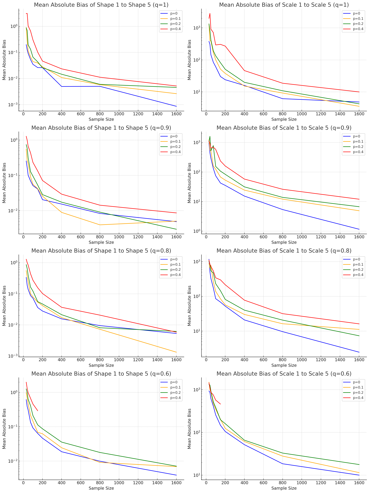
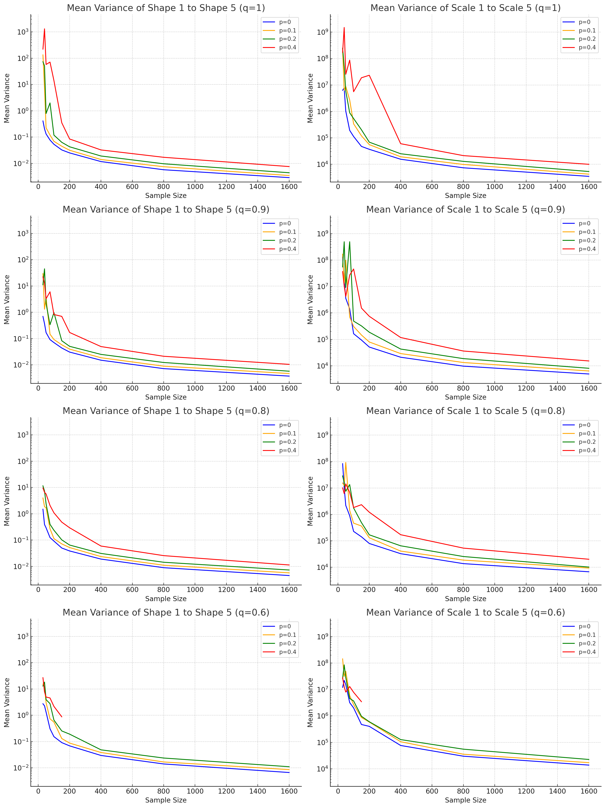
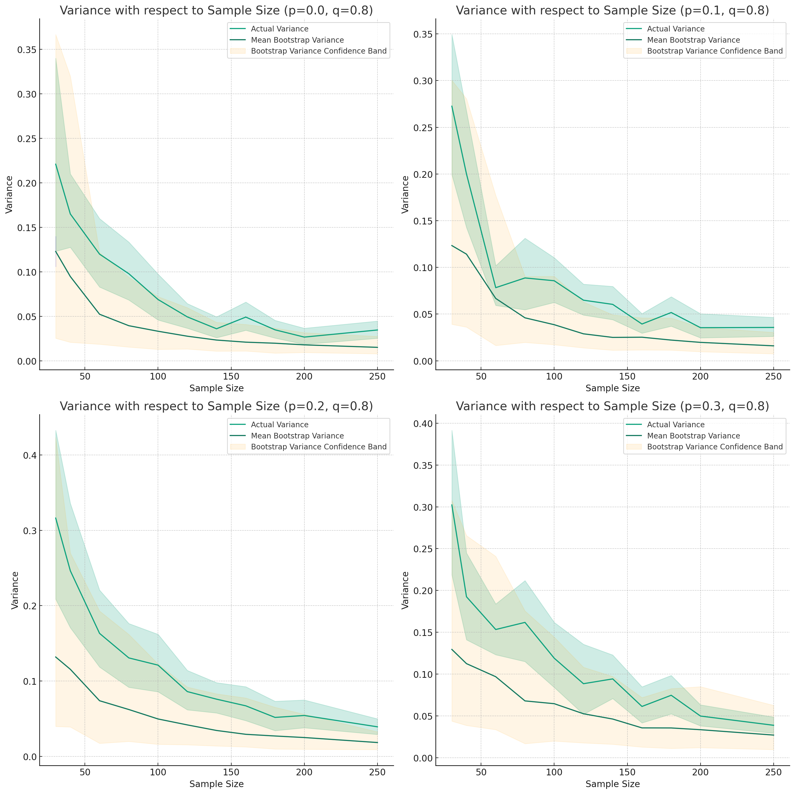
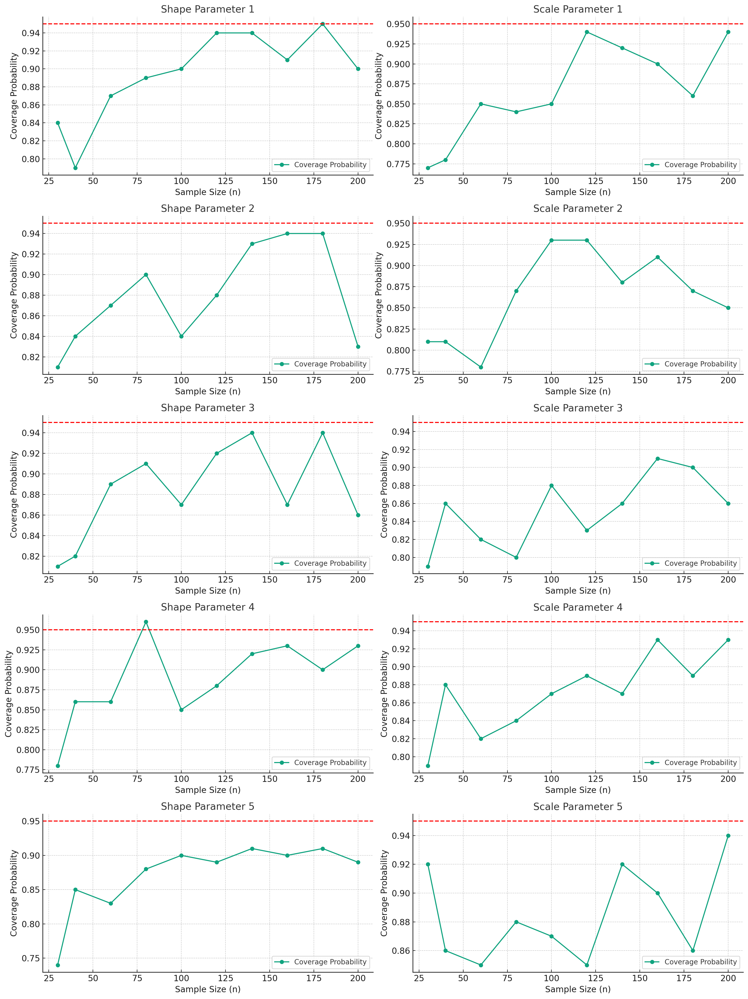
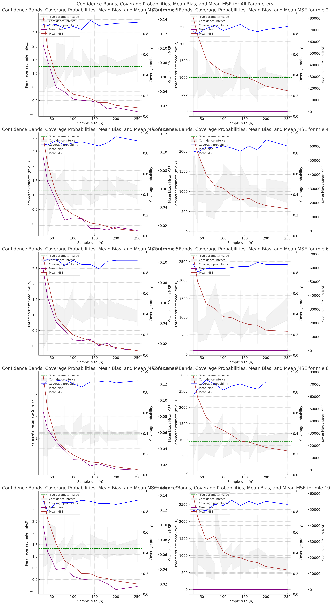
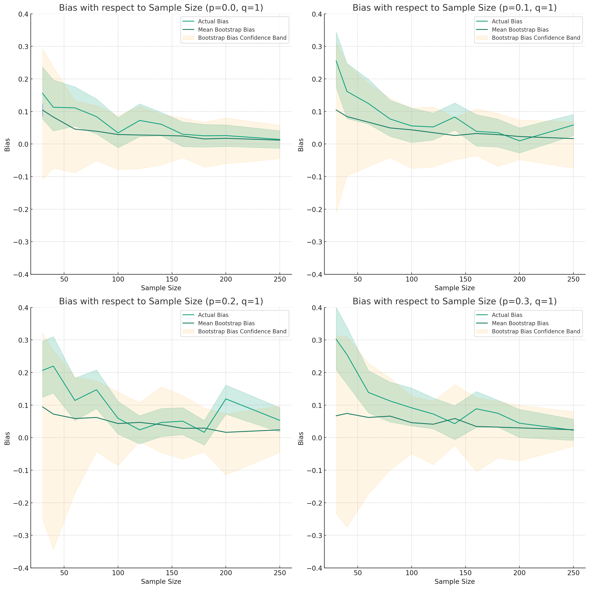
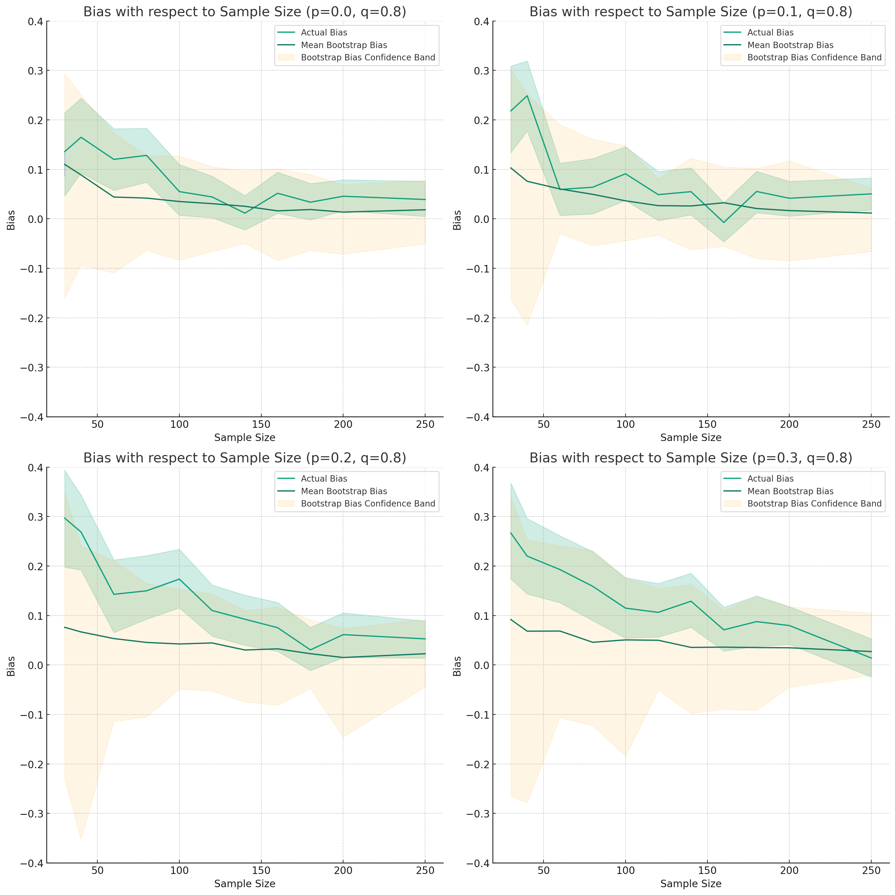
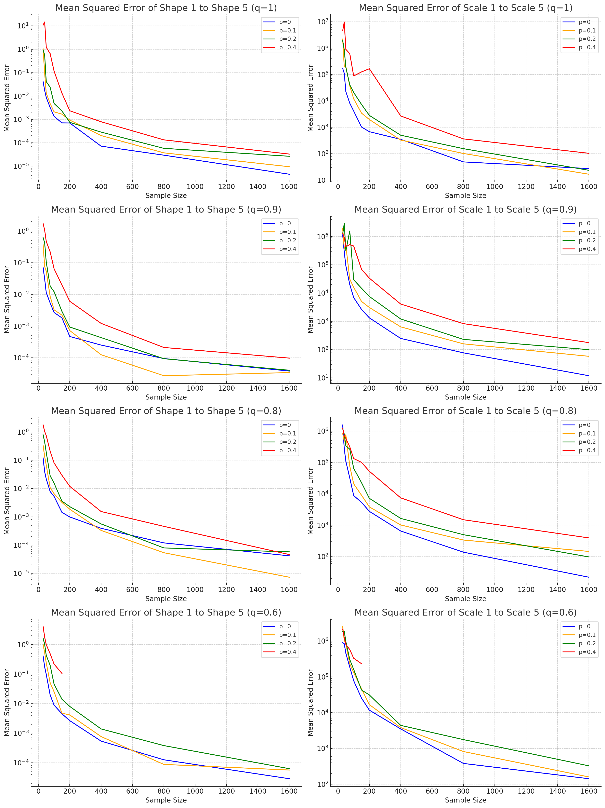

> Hi Dr. Agustin. My computer hard drive failed while running simulations, but I didn't lose any data; I 
> just can't  use my main computer with all the software I use to generate the documents.
>
> So, this is pretty rough, but we can discuss what to include in our meeting. First, I'm going to look at > the variance as a function of sample size. This has nothing to do with the bootstrap estimate of the
> variance, I just want to get an assessment of the performance of the estimator.

First, we compute the bias (empirical) of the MLE.

# Bias vs Sample Size

The array of plots above now represents the mean absolute bias of the Maximum Likelihood Estimates (MLEs) for the shape and scale parameters of each component in the series system, under different right-censoring quantiles q (q = .9 means that we set the right censoring time at the point where with probability 0.9 the system's failure will be observed). 

The first column represents the mean absolute bias of the shape parameters while the second column represents the mean absolute bias of the scale parameters.

In all plots, the x-axis represents the sample size, while the y-axis represents the mean absolute bias.
We go from q = 1 (no right censoring) to q = 0.6, significant right censoring. Each color in the plots
corresponds to a different masking probability level, where p = 0 means the component cause of failure
is *not* masked, and p = 0.4 means that there is significant masking (with probabily 0.4, a non-failed
component will be included in the candidate set).

We see that as the sample size increases, the bias decreases, which is what we expected. Asymptotically,
this appears to be an unbiased estimator. However, the masking level seems to have a significant impact on the bias, where the greater the masking, the greater the bias. As we move down the subplots, and go from q = 1 to q = 0.6, there is not as much change in the bias as I might have expected.

I should think about this more and do another simulation to try to reveal more about this, perhaps taking the quantile from 1 to, say, .2, to see if a more obvious trend emerges.

# Variance vs Sample Size

Our analysis reveals that both shape and scale parameters' variances decrease as the sample size increases. This is an expected trend, as increasing the sample size typically leads to more precise parameter estimates, hence smaller variances.

However, the level of masking probability (p) appears to have a significant impact on the variances. Specifically, as p varies from 0 values of 0.1, 0.2, and 0.4, the variances are initially substantially larger than those observed when p=0, particularly for smaller sample sizes. Nevertheless, as the sample size increases, these variances decrease and begin to approach the values observed when p=0.

This suggests that masking, or the phenomenon where the exact cause of a system failure is obscured, introduces an additional level of complexity or uncertainty to the estimation of the system parameters. This increased complexity is reflected in larger variances when the sample size is not large enough to compensate for this increased uncertainty.

However, the impact of masking appears to diminish as the sample size increases, indicating that larger datasets can effectively compensate for the added complexity introduced by masking. This finding underscores the importance of having a sufficiently large sample size when dealing with complex or uncertain systems.

In conclusion, this analysis provides valuable insights into the behavior of the parameter estimation in the presence of masking and varying sample sizes. These insights can be useful in the design and analysis of similar systems and studies.

# Bootstrapping variance

Discard the confidence band for the empirical variance, as it's suppose to be the ground truth, and
not taken to be uncertain.

The array of subplots above illustrates how the empirical variance and the
bootstrapped variance estimate, and its corresponding confidence band, change with respect to the sample size under different masking probabilities (p). Each subplot corresponds to a fixed value of p (p = 0, p = 0.1, p = 0.2, p = 0.3) and the right-censoring quantile q is kept constant at 0.8.

The orange shaded area represents the confidence band for the bootstrapped variance estimate.
We see that it tends to underestimate the variance, which is not ideal, since
this will likely mean that the confidence intervals produced by the bootstrap
will be too narrow and be poorly calibrated to the nominal level, say 95%.
Of course, as he sample size increases, the discrepeancy between the empirical bias
and the sampling dsitribution of the boostrapped bias diminishes, but especially
for small sample sizes, the discrepancy can be quite large and the variability
in the estimate of the bias quite high.

From these subplots, we also see that as the masking probability p increases, both the empirical variance and the bootstrapped variance estimate generally tend to increase slightly. Furthermore, as p increases, the confidence bands for bootstrapped variance estimate becomes wider, indicating increased uncertainty in these estimates.

# Bootstrapping confidence intervals

This is the main one I think I should do with respect to the bootstrap. I can boostrap the CI using the percentile method, and we can compute the coverage probability in various simulation scenarios, as we vary masking probability, right censoring time, and sample size in systematic ways.

In case I don't get around to doing the analysis in this document, I can say that I believe the bootstrap confidence interval will be very sensitive to the right censoring time. The more right censoring we have, when we resample from the data, the less variability we'll have. In these cases, when the right censoring is extreme, the bootstrap of the CI may not be appropriate.

This plot shows a bit of everything, from the confidence band of the confidence
intervals, along with the coverage probability (probabilities are on the right
side of the plot), to the mean bias and mean MSE.

In general, we see that the confidence intervals are centered around the
true parameter value, but up to sample sizes of $n = 250$, the coverage
probability is relatively poor, suggesting that the CIs should be taken with
a grain of salt. 

The confidence bands narrow as the smaple size increases, and tends to stablize.
We also see that the MSe and the bias decrase with sample size. All of this
together is suggestive of an  MLE that becomes more accurate and more precise
as the sample size increases.

# Bootstrapping bias

Please discard the confidence bands around the empirical bias. We are taken the
empirical bias to be the ground truth, and thus should not have confidence bands.

The series of plots above show how the empirical bias and the bootstrapped bias estimates (along with its confidence band) change with respect to the sample size under different masking probabilities (p). Each plot corresponds to a fixed value of p (p = 0.1, p = 0.2, p = 0.3) and the right-censoring quantile q is held constant at 1.

The empirical bias is represented by the green line, and the bootstrapped bias estimate by the blue line. The orange shaded area represents the confidence band for the bootstrapped bias estimate. Clearly,
for small sample sizes and for large probability masking, the confidence band is wide,
but as the sample size increases, the confidence band narrows and converges to the empirical bias
for large sample sizes.

In general, the confidence band for the bootstrapped bias includes the empirical bias. So, while the bootstraped bias may have a lot of uncertainty and error, at least it mostly contains the empirical bias.

From these plots, at a given sample size, the bias may tend to slightly increase
as the masking probability p increases. This observation is consistent across both the empirical bias and the bootstrapped bias estimates.

Moreover, the discrepancies between the empirical and bootstrapped biases also appear to increase with p, suggesting that the bootstrap method might become less accurate in estimating the bias as the masking probability increases.

Let's look at the same plot, but for q = .8.

A similar story unfolds when we fix q at .8, except maybe there is a slightly large discrepeancy
between the "true" empirical bias and the boostrapped bias. I don't think we're going to
pursue boostrapping the bias, so I doubt I'll look into this (and will probably not present the
bootstrapped bias in the paper, unless you find it interesting), electing to focus more of
my efforts on bootstrapping the CI and reporting its coverage probability.

These observations suggest that the masking probability p has an significant impact on both the bias of the parameter estimates and the performance of the bootstrap method in estimating this bias.
Therefore, it is crucial to take the masking probability into account when interpreting the results of the simulation study and when using the bootstrap method for bias estimation.

# MSE vs Sample Size

The mean squared error can be decomposed into $\operatorname{Var}(\hat\theta) + \operatorname{Bias}(\hat\theta)^2$. We showed earlier that the bias and variance was decreasing as the sample size
increased, and increasing as the masking level increased. We see the same pattern, naturally.
